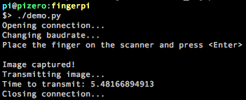

# fingerpi

[](https://www.quantifiedcode.com/app/project/1cbb69065eb748f18b315ddaccad0e12)

Python library for GT-511C3. The library was tested on Raspberry Zero.




## Connectivity

R-Pi GPIO pinout: https://pinout.xyz/

### Raspberry Pi Zero (40 pin, 3.3 V IOs)
I used optional resistors in case there is [another FTDI connection](http://www.billporter.info/2011/06/26/how-to-add-multiple-uart-connections/)

```
                       (Optional)
----------------------   1kOhm    ------------------------
GT-511C3     Tx (1)--|----/\/\----|--(10) RxD   R-Pi Zero
             Rx (2)--|----/\/\----|--(8)  TxD
            Gnd (3)--|------------|--(6) Gnd
             5V (4)--|------------|--(2) 5V
----------------------            ------------------------
```

### Raspberry Pi (40 pin, 5 V IOs)
```
----------------------                 ------------------------
GT-511C3     Tx (1)--|-----------------|--(10) RxD   R-Pi
             Rx (2)--|---.-----/\/\----|--(8)  TxD
                     |   |    1kOhm    |
                     |   \             |
                     |   /             |
                     |   \ 2kOhm       |
                     |   |             |
            Gnd (3)--|---.-------------|--(6) Gnd
             5V (4)--|-----------------|--(2) 5V
----------------------                 ------------------------
```

## Usage

Run `demo.py` for a demo

## TODO
- Documentation
- Unit tests
- GUI
